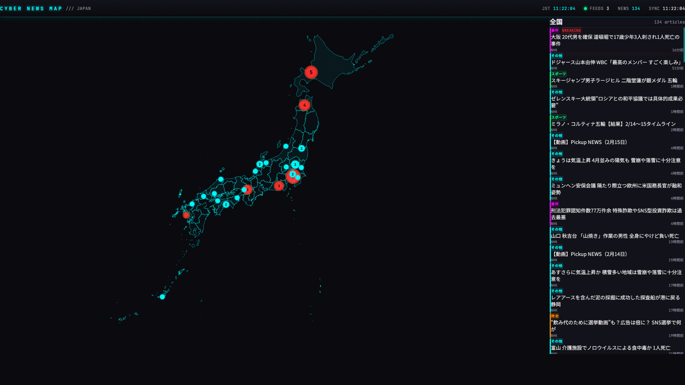

# CYBER NEWS MAP // JAPAN

日本地図上にリアルタイムニュースをマッピングするサイバーパンク風デモWebアプリ。

NHK RSSフィードからニュースを取得し、記事タイトルのキーワードマッチングで都道府県に分類。速報ニュースは派手なエフェクトで演出。



## 技術スタック

| レイヤー | 技術 |
|---------|------|
| フロントエンド | React + TypeScript, Vite, Tailwind CSS v4 |
| 地図描画 | D3.js + TopoJSON |
| アニメーション | Framer Motion |
| バックエンド | Cloudflare Workers |
| RSSパース | fast-xml-parser |

## 機能

- 47都道府県の地図表示（TopoJSON）
- ニュースの都道府県分類（キーワードマッチング）
- Breaking News検出（速報キーワード + 30分以内の記事）
- カテゴリ分類（災害・事件・政治・スポーツ・その他）
- 都道府県クリックでフィルタリング
- 60秒間隔の自動更新

## セットアップ

```bash
# フロントエンド
cd frontend
npm install
npm run dev          # http://localhost:5173

# バックエンド
cd worker
npm install
npx wrangler dev     # http://localhost:8787
```

## 環境変数

`frontend/.env.development`:

```
VITE_USE_MOCK=true          # モックデータ使用（バックエンド不要）
VITE_API_URL=http://localhost:8787  # Worker APIのURL
```

実データで動かす場合は `VITE_USE_MOCK=false` に変更。

## プロジェクト構成

```
cyber-japanese-news/
├── frontend/                # Vite + React + TypeScript
│   └── src/
│       ├── components/      # UIコンポーネント
│       ├── hooks/           # カスタムフック
│       ├── lib/             # マスタデータ・ユーティリティ
│       └── types/           # 型定義
├── worker/                  # Cloudflare Workers
│   └── src/
│       ├── index.ts         # APIエントリポイント
│       ├── rss-fetcher.ts   # RSSフェッチ + パース
│       └── region-classifier.ts  # 都道府県分類
└── docs/
    └── screenshot.png
```

## API

```
GET /api/news                    # 全ニュース取得
GET /api/news?prefecture=13      # 都道府県フィルタ（13=東京都）
```